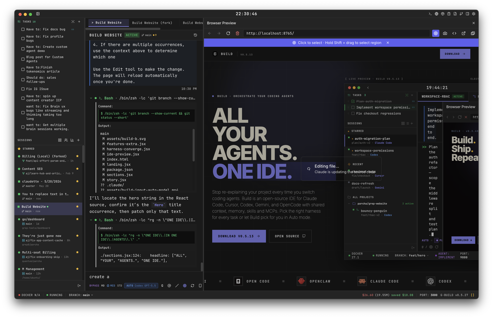

# Build

One IDE for every coding agent. Claude Code, Cursor, Codex, Gemini, OpenCode — same chat, same terminal, same preview, same git. Hot-swap harness mid-session without re-pasting context.



## Download

Download the latest macOS build from [GitHub Releases](https://github.com/Parcha-ai/build/releases).

Signed and notarized by Apple — opens without security warnings.

> Building from source works on macOS, Linux, and Windows — see [Development](#development) below.

## What It Does

Build is a desktop IDE that orchestrates your coding agents. Point it at any project folder and you get:

- **Multi-harness orchestration** — Claude Code, Cursor Agent, Codex, OpenCode, and Gemini in one window. Switch harness in a click.
- **Auto Build** — intelligent routing that picks the right harness and model for each stage: plan, build, verify, refine
- **Monaco editor** — quick search, multi-file tabs, full syntax support
- **Integrated terminal** — watch every command your agent runs
- **Live browser preview** — in-window webview with URL bar, DOM inspector, and live reload
- **Git UI** — branches, diffs, commit history, push/pull
- **SSH remote sessions** — connect to remote servers and drive agents over SSH
- **Session management** — multiple projects in parallel, each with their own branch and context
- **Semantic search** — QMD-powered codebase navigation
- **MCP servers** — connect Model Context Protocol tools for extended capabilities
- **Voice mode** — speech-to-speech conversations (optional, requires OpenAI/ElevenLabs keys)

## Quick Start

1. Download from [Releases](https://github.com/Parcha-ai/build/releases) and drag to Applications
2. Open any project folder
3. Bring your own API key — Anthropic, OpenAI, or OpenRouter
4. Start building

No account required for local-folder mode.

## Harnesses

Build doesn't ship its own agent. It's an IDE that drives existing harnesses from one workspace.

| Harness | Provider | Strengths |
|---------|----------|-----------|
| **Claude Code** | Anthropic | Long-horizon refactors, deep tool use, multi-file design |
| **Cursor Agent** | Cursor | Precision edits, composer-style sessions |
| **Codex** | OpenAI | Reasoning-heavy tasks, GPT-class and O-series models |
| **OpenCode** | Community | BYO model — Llama, Qwen, DeepSeek, anything OpenAI-compatible |
| **Gemini** | Google | Google's models via the Gemini harness |

Hot-swap harness mid-session — the conversation, files, and branch all carry over.

## Auto Build

Auto Build orchestrates multi-harness sessions automatically:

- **Plan** — lead model understands and plans the task
- **Build** — routes execution to the best-fit harness and model
- **Verify** — validates the output
- **Refine** — iterates on feedback

Select "Auto Build" from the model picker, or choose a specific model directly.

## Models

| Model | Tier |
|-------|------|
| Opus 4.7 | Flagship — most capable |
| Opus 4.6 | Highly capable |
| Sonnet 4.6 | Default — excellent balance of speed and capability |
| Sonnet 4 | Fast and capable |
| Haiku 3.5 | Instant — sub-agents, quick edits |
| GPT-5 / O3 / O4-mini | Via Codex harness |
| BYO local | Via OpenCode — Llama, Qwen, DeepSeek |

Custom models supported via API proxy. Anthropic Foundry (Azure) deployment also supported.

## Local-first, your keys

Build never proxies your API calls. Bring your own keys — Anthropic, OpenAI, OpenRouter — and calls go straight to the provider. No telemetry by default.

## Development

```bash
# Clone and install
git clone https://github.com/Parcha-ai/build.git
cd g-build
npm install

# Run in development mode
./scripts/dev.sh

# Lint
npm run lint

# Build distributable
npm run make
```

## Architecture

Electron app with a React renderer and Node.js main process:

```
src/
├── main/              # Main process — services, IPC handlers
│   └── services/      # Auto-router, Claude, Codex, Cursor, SSH, browser, git, etc.
├── renderer/          # React UI — Zustand stores, components
└── shared/            # Types and IPC channel constants
```

Key technologies: Electron 38, React 18, TypeScript, Zustand, Tailwind CSS, Monaco Editor, xterm.js, node-pty.

## License

MIT — see [LICENSE](LICENSE).
